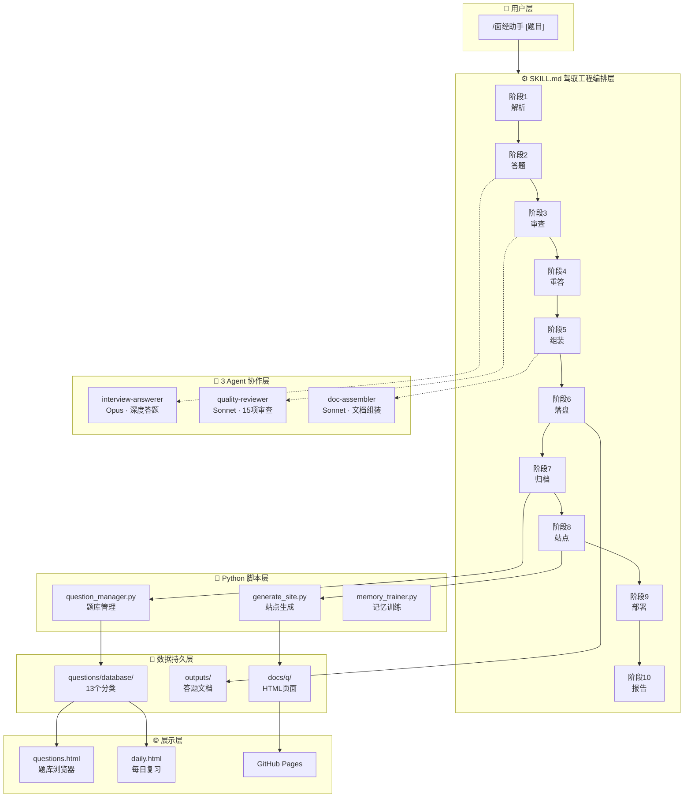
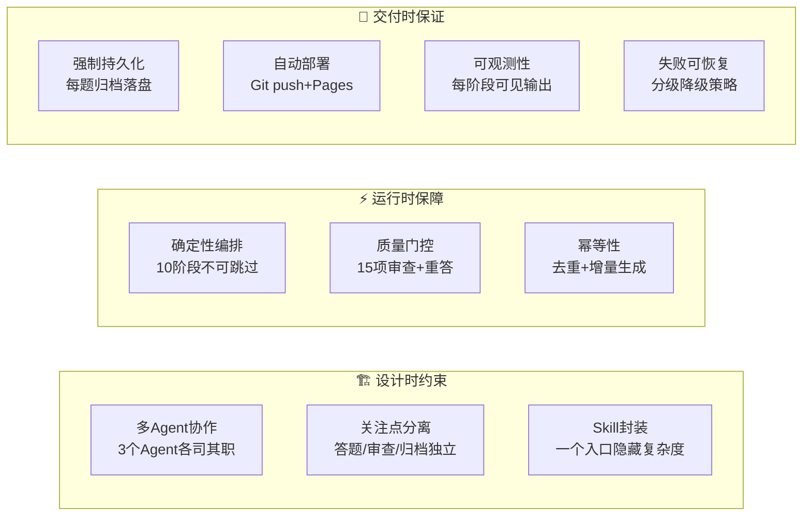
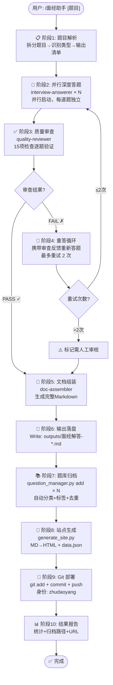
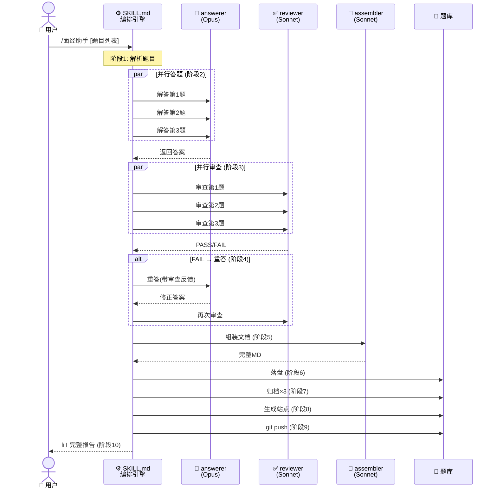
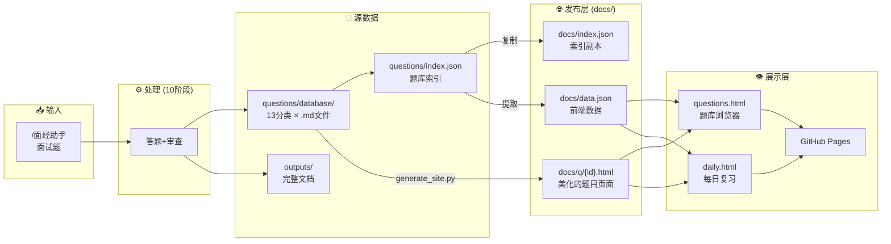
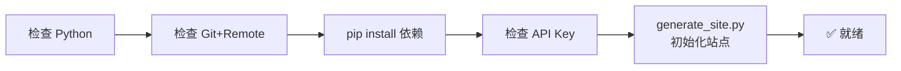

# 🎯 Interview Coach — 面经深度解答 Agent

<p align="center">
  <b>基于 Harness Engineering（驾驭工程）的 AI 面试备考系统</b><br>
  输入面试题 → 深度解答 → 质量审查 → 自动归档 → 生成文档 → Git推送 → 网页浏览
</p>

<p align="center">
  
  
  
  
  
</p>

<p align="center">
  🌐 <a href="https://ddddduo.github.io/dduo-interview-coach/questions.html"><b>在线题库浏览器</b></a>
  &nbsp;·&nbsp;
  📅 <a href="https://ddddduo.github.io/dduo-interview-coach/daily.html"><b>每日复习打卡</b></a>
  &nbsp;·&nbsp;
  🔗 <a href="https://github.com/Dddddduo/dduo-interview-coach"><b>GitHub 仓库</b></a>
</p>

---

## 📑 目录

1. [系统架构总览](#-系统架构总览)
2. [Harness Engineering 驾驭工程](#-harness-engineering-驾驭工程)
3. [完整工作流](#-完整工作流10-阶段)
4. [Agent 协作体系](#-agent-协作体系)
5. [数据管道](#-数据管道)
6. [开箱即用](#-开箱即用)
7. [使用方式](#-使用方式)
8. [项目结构](#-项目结构)

---

## 🏗️ 系统架构总览



> **架构关键**：用户只接触 `/面经助手` 一个入口。下方 5 层（编排→Agent→脚本→持久→展示）全部自动化串联。

---

## ⚙️ Harness Engineering 驾驭工程

### 什么是驾驭工程？

```
传统 Prompt 工程:    用户 → Prompt → LLM → 输出（靠运气）
                    ✕ 无审查  ✕ 无归档  ✕ 无追溯

驾驭工程:            用户 → Skill → 10阶段流水线 → 质量门控 → 强制落盘 → 自动部署
                    ✓ 多Agent协作  ✓ 确定性编排  ✓ 失败可恢复  ✓ 全程可观测
```

**Harness Engineering** 不是写一个聪明的 prompt，而是**用工程手段构建一套"缰绳"**，确保 AI 的行为可控、可追溯、可验证。

### 驾驭工程 10 维度对照



| # | 维度 | 含义 | 本项目如何实现 |
|---|------|------|---------------|
| 1 | **多 Agent 协作** | 不同 Agent 各司其职，通过契约协作 | 3 个 Agent：答题者(Opus)、审查者(Sonnet)、组装者(Sonnet)。每个有独立 system prompt、独立职责边界、独立输入输出契约 |
| 2 | **确定性编排** | 流程由工程层硬编码，不是模型自主决策 | SKILL.md 硬编码 10 阶段流程和 22 条 MUST/MUST NOT 规则。Agent 不可跳过、不可调换顺序 |
| 3 | **质量门控** | 每阶段输出通过检查才能进入下一阶段 | `quality-reviewer` 对每道题执行 15 项检查。FAIL → 自动重答(最多2次)。2次后仍 FAIL → 标记"需人工审核"，不静默丢弃 |
| 4 | **关注点分离** | 职责独立，修改一处不影响其他 | 修改审查标准只需改 reviewer agent，不影响 answerer。修改归档逻辑只需改 question_manager.py，不影响答题 |
| 5 | **强制持久化** | AI 产出结构化落盘，不可仅留在对话中 | 每道题强制归档到 `questions/database/{category}/`，独立的 .md 文件+YAML frontmatter。同时更新 `index.json` |
| 6 | **自动部署** | 产出自动推送到可访问位置 | 答案生成后 `git commit` + `git push`。`generate_site.py` 生成 HTML 到 `docs/q/`，GitHub Pages 自动更新 |
| 7 | **幂等性** | 同一输入跑两次，结果一致且无副作用 | `question_manager.py add` 执行 MD5 去重。`generate_site.py` 增量生成——MD 没变就不重新生成 HTML |
| 8 | **失败可恢复** | 每环节有明确的降级策略 | Agent 超时→重试1次；审查 FAIL→重答2次；Git push 失败→提示用户；归档失败→不影响主流程 |
| 9 | **可观测性** | 每步有可见输出，方便追踪 | 每个阶段向用户报告进度。最终报告含：通过数、重试数、归档路径、GitHub URL |
| 10 | **Skill 封装** | 复杂流程对用户透明 | `/面经助手` 一行命令触发 10 阶段全流程。用户只需输入题目 |

### 驾驭工程 vs 普通 Prompt：一张表看懂

| 对比维度 | 普通 Prompt 工程 | 驾驭工程（本项目） |
|---------|-----------------|-------------------|
| **答题** | "请回答以下面试题" | 专用 `interview-answerer` agent + system prompt 硬约束输出结构 |
| **质量** | 依赖模型自觉 | 专用 `quality-reviewer` agent，15 项清单逐项检查 |
| **失败处理** | 静默吞下或直接报错 | 自动重答+审查反馈修正，2 次后标记人工审核 |
| **归档** | 手动复制粘贴 | `question_manager.py` 自动分类+标签+去重+落盘 |
| **部署** | 手动 git push | `generate_site.py` + git push 全自动 |
| **追溯** | 对话记录，难以查找 | 每题独立文件+JSON 索引+Git 历史+网页搜索 |
| **复用** | 换个对话就丢失 | 题库永久保存，记忆训练器可随时调用 |
| **约束** | 自然语言描述，可被忽略 | 22 条硬编码 MUST/MUST NOT，编排列入 skill body |

---

## 🔄 完整工作流（10 阶段）



### 每阶段输入/输出/约束

| 阶段 | 输入 | 输出 | 关键约束 |
|------|------|------|---------|
| 1.解析 | 用户原始文本 | 题目列表+类型标注 | 每题独立完整，不合并截断 |
| 2.答题 | 每道题文本 | 记忆法+原理+思路 | **并行**启动；记忆法在**最前面** |
| 3.审查 | 原题+答案 | PASS/FAIL+问题列表 | 15 项逐项检查；FAIL 必须给具体建议 |
| 4.重答 | 原题+审查反馈 | 修正后的答案 | 最多 2 次；每次携带反馈 |
| 5.组装 | 全部通过答案 | 完整 Markdown | 保留原内容；生成可点击目录 |
| 6.落盘 | Markdown 文本 | `outputs/面经解答-*.md` | 必须 Write 到文件 |
| 7.归档 | 题目+答案 | `questions/database/{cat}/{slug}.md` | 每题执行一次 add；自动去重 |
| 8.站点 | database/ 下 .md | `docs/q/{id}.html` + `data.json` | 增量生成，未变化跳过 |
| 9.部署 | 暂存区 | GitHub 远程更新 | 身份: `zhudaoyang`/`1732446549@qq.com` |
| 10.报告 | 各阶段结果 | 统计+URL | 如实报告，不隐藏失败 |

---

## 🤖 Agent 协作体系



### 3 Agent 职责与约束

| | interview-answerer | quality-reviewer | doc-assembler |
|---|---|---|---|
| **模型** | Opus（深度推理） | Sonnet（快速） | Sonnet |
| **工具** | WebSearch, WebFetch | 无 | 无 |
| **输入** | 一道面试题 | 原题 + 答案 | N 道题答案 |
| **输出** | 🧠记忆法+📖解答+🗺️思路 | JSON: PASS/FAIL + 问题列表 | 完整 .md 文档 |

**MUST 硬约束**:

| # | answerer | reviewer | assembler |
|---|----------|----------|-----------|
| 1 | 记忆法在最前面 | 15 项逐项检查 | 生成可点击目录 |
| 2 | 四层递进(是什么→为什么→怎么用→注意) | FAIL 必须给具体建议 | 代码块加语言标签 |
| 3 | 技术题必有代码 | 不放过表面结论 | 保留 100% 内容 |
| 4 | 中英术语对照 | 审查记忆法质量 | 添加元信息 |

**MUST NOT 硬约束**:

| # | answerer | reviewer | assembler |
|---|----------|----------|-----------|
| 1 | 不允许跳过记忆法 | 不允许模糊评价"不够好" | 不允许删减内容 |
| 2 | 不允许"我觉得"等模糊词 | 不允许只抽查部分题 | 不允许改写作答内容 |

---

## 📊 数据管道



**为什么题目存两份？**

| | `questions/database/` (源) | `docs/q/` (发布) |
|---|---|---|
| **格式** | Markdown + YAML frontmatter | HTML + CSS + JS |
| **用途** | 数据管理、脚本处理 | GitHub Pages 展示 |
| **工具** | question_manager.py 读写 | generate_site.py 生成 |
| **版本** | Git 追踪 | Git 追踪 |
| **可访问** | 仅本地 | GitHub Pages URL |

---

## 🚀 开箱即用

```bash
# 1. 克隆
git clone git@github.com:Dddddduo/dduo-interview-coach.git
cd dduo-interview-coach

# 2. 一键安装
bash setup.sh

# 3. 启动 Claude Code
claude

# 4. 开始使用
/面经助手
第1题：请解释 JVM 的内存模型，堆、栈、方法区各自的职责
第2题：MySQL 索引底层为什么用 B+ 树？
```

**setup.sh 做了什么**:



### 两种使用方式

| | Claude Code Skill | Python 独立脚本 |
|---|---|---|
| **启动** | `claude` → `/面经助手` | `python scripts/interview_agent.py` |
| **需要** | Claude Code | `ANTHROPIC_API_KEY` |
| **归档** | 自动 | 自动（--no-archive 关闭） |
| **审查** | 自动 | 自动（--skip-review 关闭） |
| **推送** | 自动 | 手动 git push |

---

## 📖 使用方式

### 主入口：Claude Code Skill

```
/面经助手
第1题：请解释 CAP 理论，在分布式系统中如何权衡？
第2题：Redis 缓存穿透、击穿、雪崩分别是什么？如何解决？
第3题：描述你在项目中遇到的最大技术挑战及解决方案
```

### 题库管理

```bash
python scripts/question_manager.py stats          # 统计
python scripts/question_manager.py search "CAP"   # 搜索
python scripts/question_manager.py export         # 导出全部题库
```

### 记忆训练

```bash
# 闪卡模式
python scripts/memory_trainer.py outputs/*.md

# 填空模式
python scripts/memory_trainer.py --mode cloze outputs/*.md

# 随机挑战 (20轮)
python scripts/memory_trainer.py --mode random --rounds 20 outputs/*.md
```

### 批量处理

```bash
# 准备题库 JSON
cat > my_questions.json << 'EOF'
{
  "title": "我的面试题集",
  "questions": [
    "第一道题...",
    "第二道题..."
  ]
}
EOF

python scripts/batch_process.py my_questions.json
```

### 网页端

启用 GitHub Pages（Settings → Pages → Source: `main` `/docs` → Save）后：

| 页面 | URL |
|------|-----|
| 🏠 首页 | `https://ddddduo.github.io/dduo-interview-coach/` |
| 📚 题库浏览器 | `.../questions.html` |
| 📅 每日复习 | `.../daily.html` |
| 📄 示例输出 | `.../sample.html` |
| 📖 题目阅读 | `.../q/q0001.html` |

---

## 📁 项目结构

```
dduo-interview-coach/
│
├── .claude/                         # ⚙️ 驾驭工程配置
│   ├── settings.json                #    权限白名单 + 环境变量
│   ├── agents/                      #    Agent 定义层
│   │   ├── interview-answerer.md    #      答题 Agent (Opus)
│   │   ├── quality-reviewer.md      #      审查 Agent (Sonnet)
│   │   └── doc-assembler.md         #      组装 Agent (Sonnet)
│   └── skills/interview-coach/
│       └── SKILL.md                 #    /面经助手 入口 + 22条硬约束
│
├── scripts/                         # 🐍 Python 脚本 (可独立运行)
│   ├── interview_agent.py           #    核心 Agent + 自动归档
│   ├── batch_process.py             #    批量处理器
│   ├── question_manager.py          #    题库管理器
│   ├── memory_trainer.py            #    记忆训练器 (3模式)
│   ├── md_to_pdf.py                 #    Markdown → PDF
│   ├── generate_site.py             #    MD → HTML + data.json
│   └── push-output.sh               #    自动推送
│
├── questions/                       # 📚 题库 (13分类 × .md)
│   ├── index.json                   #    主索引
│   └── database/{java,mysql,redis...}/
│
├── docs/                            # 🌐 GitHub Pages 站点
│   ├── index.html                   #    Landing Page
│   ├── questions.html + questions.js #   题库浏览器
│   ├── daily.html + daily.js       #    每日复习
│   ├── sample.html                  #    示例输出
│   ├── data.json                    #    前端数据 (自动生成)
│   └── q/{id}.html                  #    题目阅读页 (自动生成)
│
├── outputs/                         # 📄 答题文档
├── setup.sh                         # 🚀 一键安装
├── requirements.txt                 # Python 依赖
├── README.md                        # 📖 本文件
└── CLAUDE.md                        # Claude Code 项目指引
```

---

## 🧠 驾驭工程设计决策

| # | 决策 | 理由 |
|---|------|------|
| 1 | 3 Agent 而非 1 个巨型 prompt | 关注点分离。审查标准改变不影响答题质量 |
| 2 | 10 阶段硬编码，不可跳过 | 确定性编排。防止模型"我觉得不需要归档" |
| 3 | Agent 定义在 .md 文件 | 声明式配置，可 diff，可 review，可版本控制 |
| 4 | Python 脚本 + Agent 双轨 | Python 不依赖 Claude Code，可独立运行；Agent 利用 tool use |
| 5 | 文件系统做数据库 | GitHub Pages 兼容，零依赖，Git 版本追踪 |
| 6 | 每题独立 .md + frontmatter | 方便检索、单独修改、程序可读 |
| 7 | MD5 去重 | 幂等性保证——同一题跑两次不重复 |
| 8 | 审查 FAIL 最多 2 次重试 | 防止死循环，同时给模型修正机会 |
| 9 | localStorage 做复习追踪 | 无需后端、无需登录、隐私安全 |
| 10 | 增量生成 HTML | 只重建变化的题目，加速站点构建 |

---

<p align="center">
  <b>Built with Harness Engineering</b><br>
  <sub>多 Agent 协作 · 确定性编排 · 质量门控 · 强制持久化 · 自动部署</sub>
</p>
